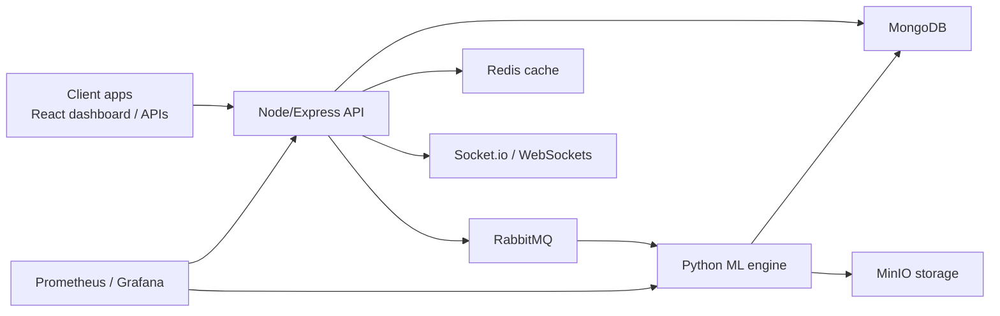
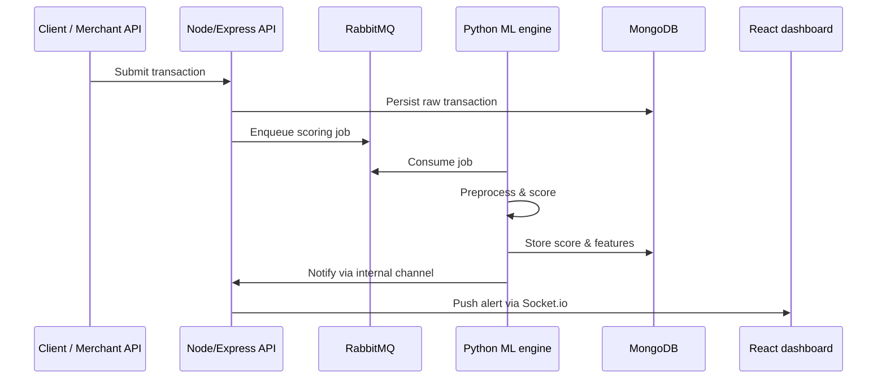

## Overview

CreditCardGuard is a fraud detection platform built as a set of loosely coupled services:

- React/Redux dashboard with Socket.io for live updates
- Node/Express API gateway with JWT/OAuth authentication
- Python ML engine for scoring, graph analysis, and model serving
- RabbitMQ for asynchronous processing and buffering
- MongoDB for time-series transaction and event storage
- Redis for low-latency caching and rate limiting
- MinIO object storage for file uploads and model artifacts
- Optional Docker/Kubernetes deployment with Prometheus/Grafana monitoring

This page explains how these components fit together and how data flows through real-time and batch paths.

## Component overview

<Columns cols={3}>

<Card title="React dashboard" href="/quickstart" icon="monitor" cta="See how it behaves">

The user-facing dashboard is a React application using Redux for state management. It connects to the backend over REST APIs and Socket.io for live alerts, risk scores, and status updates.

</Card>

<Card title="Node/Express API" href="/authentication" icon="code" cta="Review authentication">

The Node/Express layer is the main API gateway. It handles JWT/OAuth authentication, request validation, routing to internal services, and emits WebSocket events for the dashboard.

</Card>

<Card title="Python ML engine" href="/concepts" icon="database" cta="Learn ML concepts">

The Python service runs the fraud detection pipeline using libraries such as scikit-learn, TensorFlow, and NetworkX for graph-based features and anomaly detection.

</Card>

</Columns>

<Columns cols={3}>

<Card title="MongoDB time-series" href="/concepts" icon="database">

MongoDB stores raw and enriched transactions, model outputs, audit logs, and time-series analytics used by both the dashboard and offline analysis.

</Card>

<Card title="Redis cache" href="/concepts" icon="zap">

Redis provides low-latency access to hot data such as recent transaction windows, user/session context, and rate-limiting counters.

</Card>

<Card title="RabbitMQ & MinIO" href="/concepts" icon="cloud">

RabbitMQ transports events between the API and ML engine. MinIO stores file uploads, training data snapshots, and versioned model artifacts.

</Card>

</Columns>

## High-level system diagram

The following diagram shows the main components and how they communicate at a high level.

### Frontend and API gateway

- **React/Redux dashboard**:
  - Renders fraud alerts, risk scores, and investigation tools.
  - Subscribes to live events using Socket.io/WebSockets.
  - Calls REST APIs on the Node/Express backend for queries and actions.

- **Node/Express backend**:
  - Terminates client connections and applies JWT/OAuth authentication.
  - Exposes REST/JSON APIs for transaction submission, scoring requests, and reporting.
  - Publishes events into RabbitMQ for asynchronous ML processing.
  - Updates MongoDB and Redis, then pushes notifications to the dashboard over Socket.io.

### ML engine and data layer

- **Python ML engine**:
  - Consumes work items from RabbitMQ queues.
  - Runs preprocessing, feature extraction, and ML inference using scikit-learn and/or TensorFlow.
  - Uses NetworkX to compute graph-based features (for example, device or merchant networks).
  - Persists scores, features, and explanations to MongoDB.
  - Stores and loads model binaries and training artifacts from MinIO.

- **Data stores**:
  - **MongoDB**: canonical store for time-series transaction data, scores, and audit logs.
  - **Redis**: fast cache for recent history, session context, and throttling.
  - **MinIO**: S3-compatible object storage for uploads, training data exports, and model versions.

### Monitoring and observability

- **Prometheus** scrapes metrics from the Node/Express backend, the Python ML service, and other components.
- **Grafana** visualizes latency, throughput, error rates, and model-level metrics (for example, average score, queue depth).

## Data flow: real-time transaction path

The real-time path is optimized for low latency and interactive dashboards.

### Real-time request path

1. **Transaction submission**
   - A client (for example, merchant integration or internal tool) submits a transaction to the Node/Express API.
   - The API authenticates the request using JWT/OAuth and validates payloads.

2. **Immediate persistence and queuing**
   - The API writes the raw transaction into MongoDB as part of a time-series collection.
   - A scoring job reference is published into RabbitMQ.

3. **ML inference**
   - The Python ML engine consumes jobs from RabbitMQ.
   - It loads any required state from MongoDB, Redis, and MinIO (for model artifacts).
   - It runs preprocessing, feature engineering, and ML inference to produce a fraud risk score and flags.

4. **Result persistence and notification**
   - The ML engine writes scores and features back into MongoDB.
   - It emits a lightweight event (for example, via RabbitMQ or an internal channel) that the Node/Express layer can observe.

5. **Dashboard update**
   - The Node/Express service pushes an update via Socket.io/WebSockets to connected React dashboards.
   - The Redux store is updated, and the UI reflects new alerts and risk scores in near real time.

<Callout kind="info">

CreditCardGuard is designed so that typical model inference and scoring completes within approximately `50ms` for the hot path, assuming models and features are cached and the queue is not saturated.

</Callout>

## Data flow: batch and offline processing

Not all workloads require sub-second responses. Batch and offline flows support retraining, backfills, and analytics.

### Batch scoring

- Historical transactions are read from MongoDB in bulk.
- Batches are streamed through the Python ML engine for:
  - Model backfills (for example, recalculating scores after model changes).
  - Retrospective analysis and model validation.
- Results are written back to MongoDB and/or exported to MinIO for downstream analysis tools.

### Model training and deployment

- Training datasets are periodically exported to MinIO.
- Offline training jobs run on Python (potentially on separate infrastructure).
- Trained models are versioned and stored in MinIO.
- The online ML engine loads the selected model version from MinIO at startup or upon a controlled reload.

<Callout kind="tip">

Batch workloads are typically scheduled during off-peak hours and can use separate RabbitMQ queues or workers, so they do not interfere with the real-time fraud detection path.

</Callout>

## Real-time vs batch architecture

### Real-time (online) path

- **Goal**: respond quickly enough to support interactive decisions and live dashboards.
- **Characteristics**:
  - Low-latency path involving Node/Express, RabbitMQ, Python ML engine, Redis, and MongoDB.
  - Short-lived queue items and minimal preprocessing.
  - Aggressive caching of models and features in memory or Redis.
  - Push-based updates to the React dashboard over Socket.io.

### Batch and offline path

- **Goal**: maximize throughput and analytical depth, not immediate latency.
- **Characteristics**:
  - Large jobs consumed from dedicated RabbitMQ queues or directly from MongoDB.
  - Longer-running feature computation and model evaluation.
  - Use of MinIO for snapshots of datasets and model artifacts.
  - Results surfaced later in the dashboard via reporting APIs, without real-time WebSocket updates.

## WebSockets and live updates

Socket.io/WebSockets are used to keep fraud analysts and dashboards in sync without manual refresh.

- When notable events occur (for example, high-risk score, rule trigger, or model drift alert), the Node/Express backend:
  - Emits channel-specific events to the correct users or teams.
  - Updates the Redux state on the client to reflect new alerts or status changes.
- This mechanism is also used to stream:
  - Queue health (for example, backlog depth).
  - Model health and latency samples.
  - Aggregated metrics from MongoDB or Redis.

## Security boundaries and tokenization

<Callout kind="alert">

CreditCardGuard is typically deployed behind a network boundary where sensitive payment data is handled by an upstream PCI-compliant provider. The system expects tokenized or truncated card identifiers and does not require raw PAN values for scoring.

</Callout>

Key security considerations in the architecture:

- **Tokenized inputs**:
  - Integration points should provide tokens or hashed identifiers instead of full card numbers.
  - The ML engine operates on stable identifiers (for example, account tokens, device IDs, merchant IDs) and behavioral features.

- **Service-to-service authentication**:
  - Node/Express and the Python ML engine communicate over authenticated channels, typically using network policies and service identities.
  - Access to MongoDB, Redis, RabbitMQ, and MinIO is restricted by role-based credentials.

- **Auditability**:
  - MongoDB stores both input features and model outputs, enabling detailed, time-stamped audit trails.
  - Metrics in Prometheus provide visibility into anomalous behavior, error rates, and access patterns.

## Monitoring and reliability

Monitoring is built in across the stack:

- **Prometheus**:
  - Scrapes metrics from the Node/Express API (latency, error rates, request volume).
  - Scrapes from the Python ML engine (inference time, queue processing rates, model load failures).
  - Observes RabbitMQ and other infrastructure components where supported.

- **Grafana**:
  - Dashboards for:
    - Real-time scoring latency and throughput.
    - Queue depth and error counts.
    - Cache hit rates in Redis.
    - Database performance for MongoDB.
  - Alerts for SLA breaches, such as rising inference latency or queue backlog.

This monitoring layer helps maintain the real-time performance target while keeping batch workloads and maintenance operations from impacting production scoring.